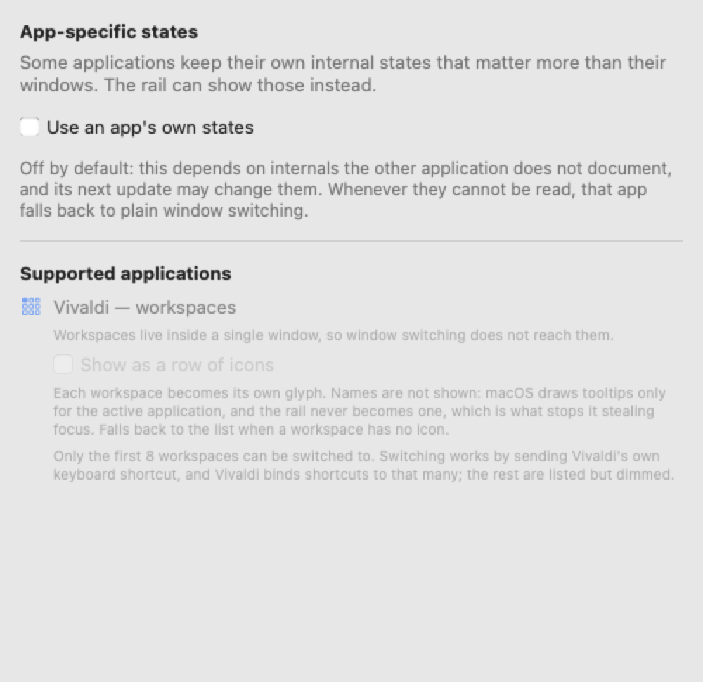

  
  <h1>PaneRail</h1>
  
<strong>A minimal floating rail listing every window of the active app on macOS — one click to switch.</strong>

  
  

---

macOS has no good way to move between windows of the same app. The Window menu
is three clicks deep, `Cmd+\`` cycles blindly, and Mission Control throws every
other app at you as well.

PaneRail puts a small always-on-top rail on screen listing the windows of
whichever app is in front. Click a row and that window comes forward. Switch to
another app and the rail follows. When there is nothing to switch between, it
gets out of the way.

## Features

- **Follows the front app.** The rail always describes the app you are looking at.
- **Never steals focus.** Clicking the rail does not change which app is active.
- **Stays out of the way.** Hidden until an app has more than one window, and
  while a window fills the screen.
- **Goes where you put it.** Drag it by its handle; each app remembers its own spot.
- **Minimised windows included**, shown dimmed, and restored when clicked.
- **No Dock icon.** It lives in the menu bar, where the icon turns into a
  warning sign if Accessibility access is missing.

## Install

### From a release

1. Download `PaneRail-x.y.z.zip` from
   [Releases](https://github.com/kafeg/panerail/releases).
2. Double-click the archive in Finder to unpack it.
3. Drag `PaneRail.app` into your **Applications** folder.
4. Double-click it. macOS refuses to open it — that is expected, see below.

### Letting macOS open it

Releases are not notarised, so Gatekeeper blocks the first launch. On macOS 15
and later the old Control-click shortcut no longer works. Instead:

1. Open **System Settings › Privacy & Security**.
2. Scroll down to **Security**. There is a line saying PaneRail was blocked.
3. Click **Open Anyway** and confirm with Touch ID or your password.
4. Launch PaneRail again and click **Open** in the dialog that appears.

This is needed once per version. Building from source skips it entirely — a
locally built app is never quarantined; see
[docs/BUILDING.md](docs/BUILDING.md).

### Granting Accessibility access

PaneRail then asks for Accessibility access in **System Settings › Privacy &
Security › Accessibility**. It is the only API macOS offers for reading and
raising another app's windows, so without it the rail has nothing to show. The
rail appears the moment the switch is flipped — no restart needed.

It reads window titles only. It never records the screen, and never sends
anything anywhere.

> If PaneRail is already switched on in that list and the rail still does not
> appear, remove it with **−** and add it again. macOS ties the permission to
> the app's signature, so an update invalidates it while the switch still looks
> on.

## Settings

Open them from the gear in the rail's handle or from the menu bar icon. The
permission state is the first thing the window reports, and it updates live.

  
  

| Setting | What it does |
| --- | --- |
| Show the rail | Turns the rail off without quitting |
| Show for | Every application, only the ones ticked in the Apps tab, or everything except those |
| Appear from *n* windows | The rail stays hidden below this many windows. Set it to 1 to always show it |
| Hide in full screen | Gets out of the way while a window fills the screen |
| Width | 160–380 pt |
| Position | Remembered per application, or one position for everything. An application the rail has not been placed for opens in the top right corner |
| Launch at login | Registers a login item via `SMAppService` |

## App-specific states (experimental)

Some applications keep their own internal states that matter more than their
windows. With **Use an app's own states** switched on, in the Advanced tab, the
rail shows those instead.

It is off by default because it depends on undocumented internals of the app in
question, which that app's next update may change. Whenever those internals
cannot be read, the app falls back to plain window switching.

**Vivaldi** is the one supported so far. Its workspaces all live inside a single
window, so window switching does not help with them at all, and its own picker
is a dropdown at the top of the window. The rail lists the workspaces, marks the
active one and switches with a click.

It can also show them as a row of glyphs — Vivaldi stores each workspace's icon
as inline SVG, so those are the real icons:

  
  

Names are not shown in that layout: macOS draws tooltips only for the active
application, and the rail never becomes active — which is precisely what keeps
clicking it from stealing focus.

Only the first eight workspaces can be switched to. Switching works by sending
Vivaldi's own keyboard shortcut, and Vivaldi binds shortcuts to that many; the
rest are listed but dimmed.

## Limitations

- **Full-screen spaces.** A floating panel over another app's full-screen window
  is unreliable on macOS, regardless of collection behaviour. The rail hides
  itself there by default.
- **Raising a window on another Space** switches you to that Space. That is how
  macOS works, not a bug.
- **Not on the Mac App Store, and cannot be.** The App Sandbox blocks
  cross-process Accessibility calls and no entitlement lifts that, which is why
  window managers either predate the sandbox requirement or ship outside the
  Store.

## Development

- [Building and releasing](docs/BUILDING.md)
- [How it works](docs/ARCHITECTURE.md)

## License

[MIT](LICENSE).
