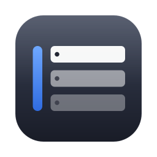
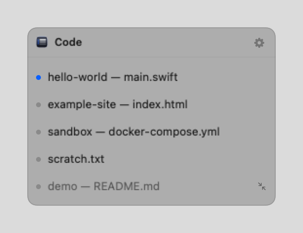
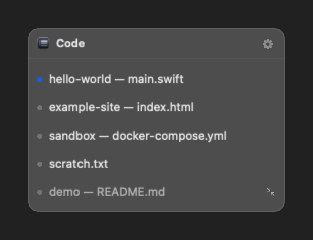
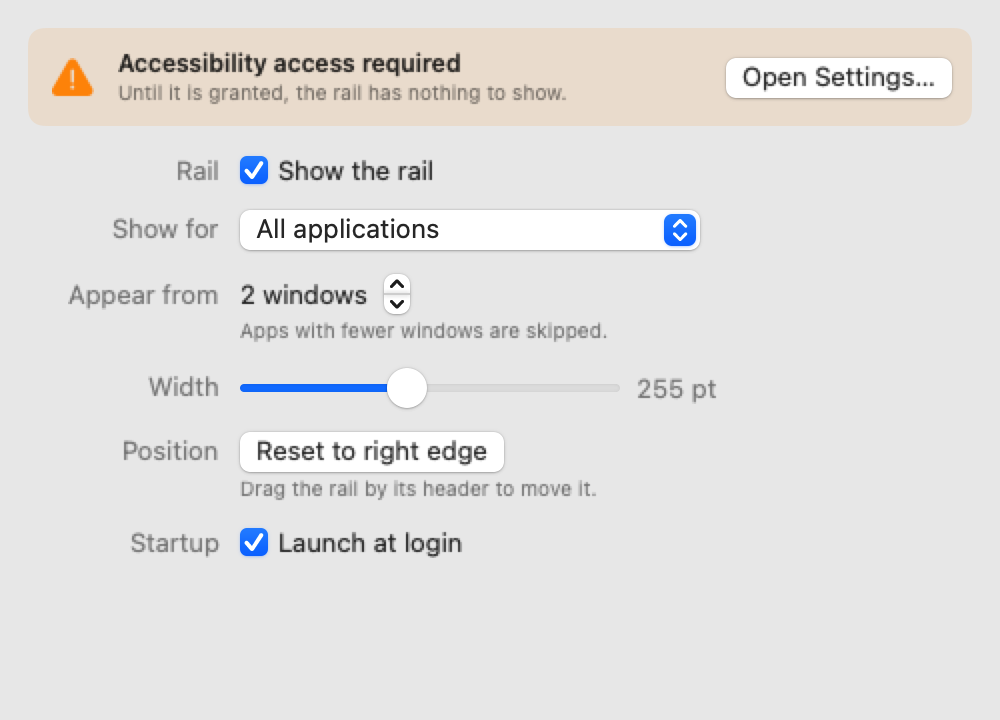

<div align="center">
  
  <h1>PaneRail</h1>
  <p><strong>A minimal floating rail listing every window of the active app on macOS — one click to switch.</strong></p>
</div>

<div align="center">
  
  
</div>

---

macOS has no good way to move between windows of the same app. The Window menu
is three clicks deep, `Cmd+\`` cycles blindly, and Mission Control throws every
other app at you as well.

PaneRail puts a small always-on-top rail on screen listing the windows of
whichever app is in front. Click a row and that window comes forward. Switch to
another app and the rail follows. When there is nothing to switch between, it
gets out of the way.

## Features

- **Follows the front app.** The rail always describes the app you are looking at.
- **Never steals focus.** It is a non-activating panel, so clicking it does not
  change which app is active.
- **Stays out of the way.** Hidden by default until an app has more than one
  window; the threshold is configurable, as is an allow list of specific apps.
- **Drag it anywhere.** Grab the header and drop the rail where you want it. The
  position is remembered.
- **Minimised windows included**, shown dimmed, and restored when clicked.
- **No Dock icon.** It lives in the menu bar, where the icon turns into a
  warning sign if Accessibility access is missing.

## Install

Download the latest `PaneRail.zip` from
[Releases](https://github.com/kafeg/panerail/releases), unzip it and move
`PaneRail.app` to `/Applications`.

Builds are not yet notarised, so the first launch needs a right-click on the app
and **Open** rather than a double-click.

### Accessibility permission

PaneRail needs Accessibility access in **System Settings › Privacy & Security ›
Accessibility**. This is the only API macOS offers for reading and raising
another app's windows; without it the rail has nothing to show. The app prompts
on first launch and starts working the moment the switch is flipped — no restart
required.

It reads window titles only. It never records the screen, and deliberately does
not use `CGWindowList`, which would have required the Screen Recording
permission just to see titles.

## Settings

Open them from the gear in the rail's header or from the menu bar icon. The
permission state is the first thing the window reports, and it updates live —
no need to reopen it after granting access.

<div align="center">
  
</div>

| Setting | What it does |
| --- | --- |
| Show for | All applications, or only the ones you tick in the Apps tab |
| Appear from *n* windows | The rail stays hidden below this many windows. Set it to 1 to always show it |
| Width | 160–380 pt |
| Position | Reset the rail back to the right edge |
| Launch at login | Registers a login item via `SMAppService` |

## Building from source

Requires Xcode 16 or newer and [XcodeGen](https://github.com/yonaskolb/XcodeGen)
(`brew install xcodegen`). The `.xcodeproj` is generated from `project.yml` and
is not checked in.

```sh
make build     # build the Debug app
make test      # run the unit tests
make demo      # launch against scripted windows, no permission needed
make package   # build Release and zip it into dist/
```

`make demo` is the fastest way to work on the UI: it swaps the Accessibility
window source for fixed sample data, so nothing needs to be granted.

Because macOS binds an Accessibility grant to the app's code signature, every
local rebuild looks like a brand new app to the system. If the rail stops
appearing after a rebuild, run `make reset-permission` and grant access again.

## How it works

| Piece | Role |
| --- | --- |
| `FrontmostAppMonitor` | Watches `NSWorkspace` activation notifications, ignoring PaneRail itself |
| `AXWindowSource` | Reads windows through `AXUIElement`, and raises them with `kAXRaiseAction` plus an app activation |
| `RailCoordinator` | Holds the state: current app, its windows, and whether the rail should be visible |
| `RailVisibility` | The pure show/hide rule |
| `RailGeometry` | Panel sizing and clamping to the visible screen frame |
| `RailPanel` | A borderless, non-activating `NSPanel` floating above everything |

Everything that makes a decision lives in `PaneRailKit`, a static library the
app and the test bundle both link, so the logic is covered by unit tests without
needing a window server or a permission grant. It is deliberately not a
framework: the hardened runtime turns on library validation, which refuses to
load an embedded framework whose ad-hoc signature was produced independently of
the app's.

## Limitations

- **Full-screen spaces.** A floating panel over another app's full-screen window
  is unreliable on macOS, regardless of collection behaviour.
- **Raising a window on another Space** switches you to that Space. That is how
  macOS works, not a bug.
- **Not on the Mac App Store, and cannot be.** The App Sandbox blocks
  cross-process Accessibility calls and no entitlement lifts that, which is why
  window managers either predate the sandbox requirement or ship outside the
  Store.

## License

[MIT](LICENSE).
